# Praktikum 2 - Class and Object

Nama : Muhammad Naufal Haidar Setyawan <br>
NIM : 2241720097 <br>
Kelas : 2C <br>
No. Absen : 18 <br>

## Percobaan 1 - Membuat Class Diagram

Studi Kasus 1: <br>
Dalam suatu perusahaan salah satu data yang diolah adalah data karyawan. Setiap karyawan memiliki id, nama, jenis kelamin, jabatan, jabatan, dan gaji. Setiap mahasiswa juga bisa menampilkan data diri pribadi dan melihat gajinya.

1. Gambarkan desain class diagram dari studi kasus 1! <br>
   **Jawab :** <br>
   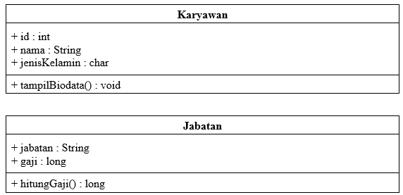 <br>
2. Sebutkan Class apa saja yang bisa dibuat dari studi kasus 1! <br>
   **Jawab :** <br>

   ```
   Class : Karyawan, Jabatan
   ```

3. Sebutkan atribut beserta tipe datanya yang dapat diidentifikasi dari masing-masing
   class dari studi kasus 1! <br>
   **Jawab :** <br>

   ```
   Atribut :

   - Class Karyawan : id (int), nama (String), jenisKelamin (char)
   - Class Jabatan : jabatan (String), gaji (long)
   ```

4. Sebutkan method-method yang sudah anda buat dari masing-masing class pada studi
   kasus 1! <br>
   **Jawab :** <br>

   ```
   Method :

   - Class Karyawan : tampilBiodata() -> void
   - Class Jabatan : hitungGaji() -> long
   ```

## Percobaan 2 - Membuat dan mengakses anggota suatu class

Studi Kasus 2: <br>
Perhatikan class diagram dibawah ini. Buatlah program berdasarkan class diagram tersebut!

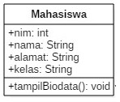 <br>

6. Jalankan class TestMahasiswa <br>
   **Jawab :** <br>
   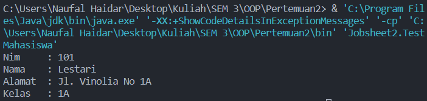 <br>
7. Jelaskan pada bagian mana proses pendeklarasian atribut pada program diatas! <br>
   **Jawab :** <br>
   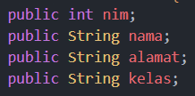 <br>
8. Jelaskan pada bagian mana proses pendeklarasian method pada program diatas! <br>
   **Jawab :** <br>
   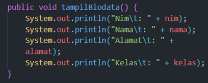 <br>
9. Berapa banyak objek yang di instansiasi pada program diatas! <br>
   **Jawab :** <br>
   1 yaitu mhs1
10. Apakah yang sebenarnya dilakukan pada sintaks program `mhs1.nim=101` ? <br>
    **Jawab :** <br>
    Menginisialisasi nilai atribut nim dari objek mhs1 menjadi 101
11. Apakah yang sebenarnya dilakukan pada sintaks program `mhs1.tampilBiodata()` ? <br>
    **Jawab :** <br>
    Memanggil method tampilBiodata() dari objek mhs1
12. Instansiasi 2 objek lagi pada program diatas! <br>
    **Jawab :** <br>
    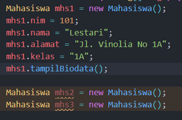 <br>

## Percobaan 3 - Menulis method yang memiliki argument/parameter dan memiliki return

6. Jalankan program tersebut! <br>
   **Jawab :** <br>
   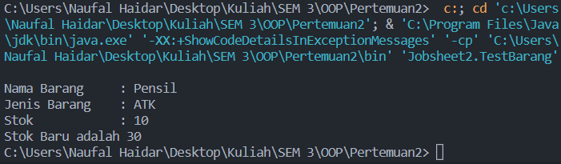 <br>
7. Apakah fungsi argumen dalam suatu method? <br>
   **Jawab :** <br>
   Argumen adalah nilai yang dikirimkan ke parameter saat fungsi dipanggil. Argumen memungkinkan kita untuk memberikan nilai input ke fungsi yang kemudian dapat digunakan oleh fungsi tersebut untuk melakukan operasi tertentu.
8. Ambil kesimpulan tentang kegunaan dari kata kunci return , dan kapan suatu method harus memiliki return! <br>
   **Jawab :** <br>
   `return` berfungsi untuk mengembalikan nilai dari sebuah method. Nilai ini bisa berupa hasil perhitungan, data, objek, atau apa pun yang ingin dikembalikan dari fungsi tersebut.

## Tugas

1.  Suatu toko persewaan video game salah satu yang diolah adalah peminjaman, dimana data yang dicatat ketika ada orang yang melakukan peminjaman adalah id, nama member, nama game, dan harga yang harus dibayar. Setiap peminjaman bisa menampilkan data hasil peminjaman dan harga yang harus dibayar. Buatlah class diagram pada studi kasus diatas!

    Penjelasan:

    - Harga yang harus dibayar diperoleh dari lama sewa x harga.
    - Diasumsikan 1x transaksi peminjaman game yang dipinjam hanya 1 game saja.

    **Jawab :** <br>
    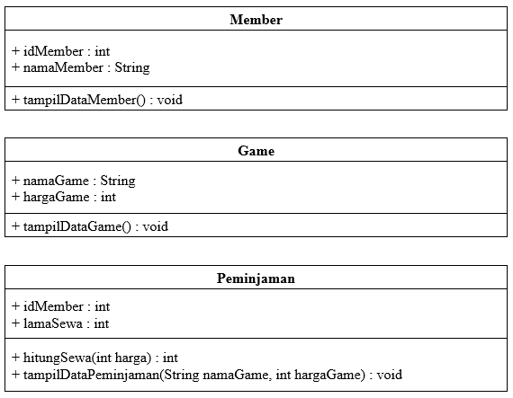 <br>

2.  Buatlah program dari class diagram yang sudah anda buat di no 1!

    **Jawab :** <br>
    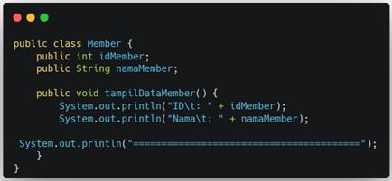 <br>
    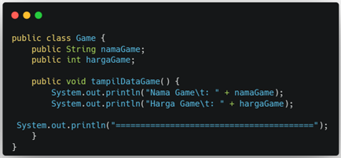 <br>
    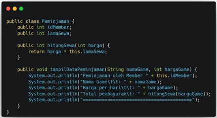 <br>
    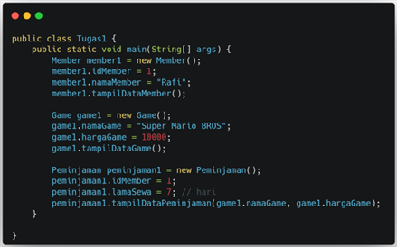 <br>

3.  Buatlah program sesuai dengan class diagram berikut ini:

    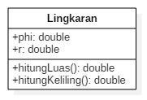 <br>

    **Jawab :** <br>
    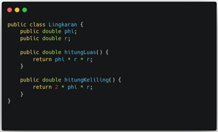 <br>

4.  Buatlah program sesuai dengan class diagram berikut ini:

    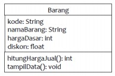 <br>

    Deskripsi / Penjelasan :

    - Nilai atribut hargaDasar dalam Rupiah dan atribut diskon dalam %
    - Method hitungHargaJual() digunakan untuk menghitung harga jual dengan perhitungan berikut ini: <br>

      **harga jual = harga dasar – (diskon x harga dasar)**

    - Method tampilData() digunakan untuk menampilkan nilai dari kode, namaBarang hargaDasar, diskon dan harga jual.

    **Jawab :** <br>
    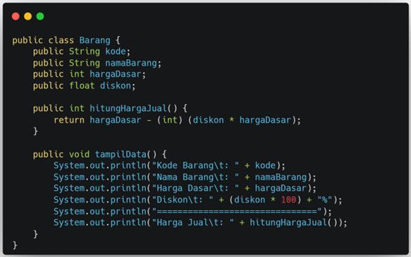 <br>
