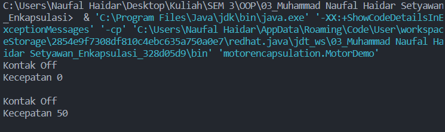
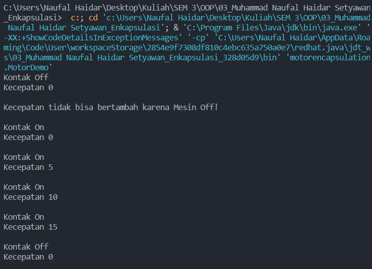
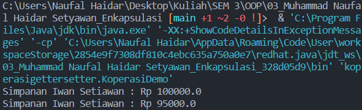
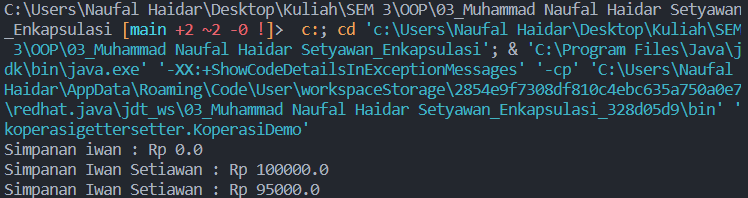
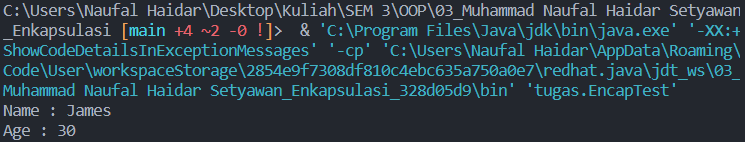
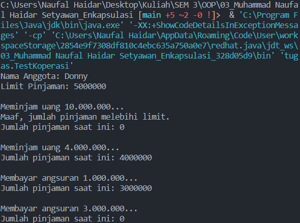

# Praktikum 3 - Enkapsulasi

Nama : Muhammad Naufal Haidar Setyawan <br>
NIM : 2241720097 <br>
Kelas : 2C <br>
No. Absen : 18 <br>

## Percobaan 1 - Enkapsulasi

Code :

- Class Motor

```
package motorencapsulation;

public class Motor {
    public int kecepatan = 0;
    public boolean kontakOn = false;

    public void printStatus() {
        if (kontakOn == true) {
            System.out.println("Kontak On");
        } else {
            System.out.println("Kontak Off");
        }
        System.out.println("Kecepatan " + kecepatan + "\n");
    }
}
```

- Class Motor Demo :

```
package motorencapsulation;

public class MotorDemo {
    public static void main(String[] args) {
        Motor motor = new Motor();
        motor.printStatus();
        motor.kecepatan = 50;
        motor.printStatus();
    }
}
```

Output : <br><br>


## Percobaan 2 - Access Modifier

Code :

- Class Motor

```
package motorencapsulation;

package motorencapsulation;

public class Motor {
    private int kecepatan = 0;
    private boolean kontakOn = false;

    public void nyalakanMesin() {
        kontakOn = true;
    }

    public void matikanMesin() {
        kontakOn = false;
        kecepatan = 0;
    }

    public void tambahKecepatan() {
        if (kontakOn == true) {
            kecepatan += 5;
        } else {
            System.out.println("Kecepatan tidak bisa bertambah karena Mesin Off! \n");
        }
    }

    public void kurangiKecepatan() {
        if (kontakOn == true) {
            kecepatan -= 5;
        } else {
            System.out.println("Kecepatan tidak bisa bertambah karena Mesin Off! \n");
        }
    }

    public void printStatus() {
        if (kontakOn == true) {
            System.out.println("Kontak On");
        } else {
            System.out.println("Kontak Off");
        }
        System.out.println("Kecepatan " + kecepatan + "\n");
    }
}
```

- Class MotorDemo :

```
package motorencapsulation;

public class MotorDemo {
    public static void main(String[] args) {
        Motor motor = new Motor();
        motor.printStatus();
        motor.tambahKecepatan();

        motor.nyalakanMesin();
        motor.printStatus();

        motor.tambahKecepatan();
        motor.printStatus();

        motor.tambahKecepatan();
        motor.printStatus();

        motor.tambahKecepatan();
        motor.printStatus();

        motor.matikanMesin();
        motor.printStatus();

    }
}
```

Output : <br><br>


### Pertanyaan - Percobaan 2

- Pada class TestMobil, saat kita menambah kecepatan untuk pertama kalinya, mengapa muncul peringatan “Kecepatan tidak bisa bertambah karena Mesin Off!”? <br>
  **Jawab :** <br>
  Karena di dalam method tambahKecepatan() ada pengecekan `if (kontakOn == true)`. Jika kondisi tidak terpenuhi maka akan menampilkan output _"Kecepatan tidak bisa bertambah karena Mesin Off!"_
- Mengapa atribut kecepatan dan kontakOn diset private? <br>
  **Jawab :** <br>
  Agar tidak dapat diakses dari class lain, sehingga untuk mengubah value dari variabel tersebut memerlukan untuk mengakses method.
- Ubah class Motor sehingga kecepatan maksimalnya adalah 100! <br>
  **Jawab :** <br>

```
public void tambahKecepatan() {
        if (kontakOn == true) {
            if (kecepatan < 100) {
                kecepatan += 5;
            } else {
                System.out.println("Kecepatan sudah mencapai maksimal!");
            }
        } else {
            System.out.println("Kecepatan tidak bisa bertambah karena Mesin Off! \n");
        }
    }
```

## Percobaan 3 - Getter dan Setter

Code :

- Class Anggota

```
package koperasigettersetter;

public class Anggota {
    private String nama;
    private String alamat;
    private float simpanan;

    public void setNama(String nama) {
        this.nama = nama;
    }

    public void setAlamat(String alamat) {
        this.alamat = alamat;
    }

    public String getNama() {
        return nama;
    }

    public String getAlamat() {
        return alamat;
    }

    public float getSimpanan() {
        return simpanan;
    }

    public void setor(float uang) {
        simpanan += uang;
    }

    public void pinjam(float uang) {
        simpanan -= uang;
    }
}
```

- Class KoperasiDemo :

```
package koperasigettersetter;

public class KoperasiDemo {
    public static void main(String[] args) {
        Anggota anggota1 = new Anggota();
        anggota1.setNama("Iwan Setiawan");
        anggota1.setAlamat("Jalan Sukarno Hatta no 10");
        anggota1.setor(100000);
        System.out.println("Simpanan " + anggota1.getNama() + " : Rp " + anggota1.getSimpanan());

        anggota1.pinjam(5000);
        System.out.println("Simpanan " + anggota1.getNama() + " : Rp " + anggota1.getSimpanan());
    }
}
```

Output : <br><br>


## Percobaan 4 - Konstruktor, Instansiasi

Code :

- Class Anggota :

```
package koperasigettersetter;

public class Anggota {
    private String nama;
    private String alamat;
    private float simpanan;

    Anggota(String nama, String alamat) {
        this.nama = nama;
        this.alamat = alamat;
        this.simpanan = 0;
    }

    public void setNama(String nama) {
        this.nama = nama;
    }

    public void setAlamat(String alamat) {
        this.alamat = alamat;
    }

    public String getNama() {
        return nama;
    }

    public String getAlamat() {
        return alamat;
    }

    public float getSimpanan() {
        return simpanan;
    }

    public void setor(float uang) {
        simpanan += uang;
    }

    public void pinjam(float uang) {
        simpanan -= uang;
    }
}
```

- Class KoperasiDemo :

```
package koperasigettersetter;

public class KoperasiDemo {
    public static void main(String[] args) {
        Anggota anggota1 = new Anggota("iwan", "Jalan Mawar");
        System.out.println("Simpanan " + anggota1.getNama() + " : Rp " + anggota1.getSimpanan());

        anggota1.setNama("Iwan Setiawan");
        anggota1.setAlamat("Jalan Sukarno Hatta no 10");
        anggota1.setor(100000);
        System.out.println("Simpanan " + anggota1.getNama() + " : Rp " + anggota1.getSimpanan());

        anggota1.pinjam(5000);
        System.out.println("Simpanan " + anggota1.getNama() + " : Rp " + anggota1.getSimpanan());
    }
}
```

Output : <br><br>


### Pertanyaan - Percobaan 3 dan 4

- Apa yang dimaksud getter dan setter? <br>
  **Jawab :** <br>
  Getter adalah method public yang memiliki tipe data return, berfungsi untuk mendapatkan nilai dari atribut yang bersifat private. Sedangkan setter adalah method public yang tidak memliki tipe data return, berfungsi untuk memanipulasi nilai dari atribut yang bersifat private.
- Apa kegunaan dari method getSimpanan()? <br>
  **Jawab :** <br>
  Untuk mendapatkan value dari atribut simpanan, karena atribut simpanan memiliki access modifier **private**
- Method apa yang digunakan untk menambah saldo? <br>
  **Jawab :** <br>
  `setor()`
- Apa yang dimaksud konstruktor? <br>
  **Jawab :** <br>
  Konstruktor adalah method istimewa yang digunakan untuk mengatur value dari atribut objek saat objek di-instansiasi. Konstruktor memiliki nama method yang sama dengan class.
- Sebutkan aturan dalam membuat konstruktor? <br>
  **Jawab :** <br> - Nama konstruktor harus sama dengan nama class<br> - Konstruktor tidak bisa memberikan nilai return (bertipe void)<br> - Konstruktor tidak boleh menggunakan modifier abstract, static, final, dan syncronized<br>
- Apakah boleh konstruktor bertipe private? <br>
  **Jawab :** <br>
  Boleh. Di java, konstruktor dapat memiliki access modifier private, protected, public dan default.
- Kapan menggunakan parameter dengan passing parameter? <br>
  **Jawab :** <br>
  Saat ada sebuah metode yang memerlukan parameter untuk memanipulasi suatu nilai. Biasanya berupa konstruktor ataupun metode yang memproses suatu perhitungan.
- Apa perbedaan atribut class dan instansiasi atribut? <br>
  **Jawab :** <br>
  Atribut pada class terikat pada class yang bersangkutan dan menjadi _template_ untuk membuat objek. Sedangkan instansiasi atribut pada objek dapat berbeda-beda antara objek satu dengan yang lain dan hanya terikat pada 1 objek yang bersangkutan.
- Apa perbedaan class method dan instansiasi method? <br>
  **Jawab :** <br>
  Method pada class terikat pada class yang bersangkutan dan dapat diakses langsung melalui nama class. Sedangkan instansiasi method pada objek hanya terikat pada 1 objek yang bersangkutan dan untuk mengaksesnya perlu memanggil objek tersebut.

## Tugas

- Cobalah program dibawah ini dan tuliskan hasil outputnya <br>

  ```
  public class EncapDemo {
      private String name;
      private int age;

      public String getName() {
          return name;
      }

      public void setName(String newName) {
          name = newName;
      }

      public int getAge() {
          return age;
      }

      public void setAge(int newAge) {
          if (newAge > 30) {
              age = 30;
          } else {
              age = newAge;
          }
      }
  }
  ```

  ```
  public class EncapTest {
      public static void main(String[] args) {
          EncapDemo encap = new EncapDemo();
          encap.setName("James");
          encap.setAge(35);

          System.out.println("Name : " + encap.getName());
          System.out.println("Age : " + encap.getAge());
      }
  }
  ```

  Output :<br>
  

- Pada program diatas, pada class EncapTest kita mengeset age dengan nilai 35, namun pada saat ditampilkan ke layar nilainya 30, jelaskan mengapa.<br>
  **Jawab :** <br>
  Karena ada pengecekan di method setAge() yaitu

  ```
  if (newAge > 30) {
            age = 30;
        }
  ```

- Ubah program diatas agar atribut age dapat diberi nilai maksimal 30 dan minimal 18. <br>
  **Jawab :** <br>

  ```
  public void setAge(int newAge) {
      if (newAge >= 18 && newAge <= 30) {
          age = newAge;
      } else {
          System.out.println("Minimal umur adalah 18 dan maksimal umur adalah 30!");
      }
  }
  ```

- Pada sebuah sistem informasi koperasi simpan pinjam, terdapat class Anggota yang memiliki atribut antara lain nomor KTP, nama, limit peminjaman, dan jumlah pinjaman. Anggota dapat meminjam uang dengan batas limit peminjaman yang ditentukan. Anggota juga dapat mengangsur pinjaman. Ketika Anggota tersebut mengangsur pinjaman, maka jumlah pinjaman akan berkurang sesuai dengan nominal yang diangsur. Buatlah class Anggota tersebut, berikan atribut, method dan konstruktor sesuai dengan kebutuhan. Uji dengan TestKoperasi berikut ini untuk memeriksa apakah class Anggota yang anda buat telah sesuai dengan yang diharapkan <br>
  **Jawab :** <br>

  - Class Anggota :

    ```
    package tugas;

    public class Anggota {
        private String noKTP;
        private String nama;
        private int limitPinjaman;
        private int jumlahPinjaman;

        Anggota(String noKTP, String nama, int limitPinjaman) {
            this.noKTP = noKTP;
            this.nama = nama;
            this.limitPinjaman = limitPinjaman;
        }

        public String getNama() {
            return nama;
        }

        public int getLimitPinjaman() {
            return limitPinjaman;
        }

        public int getJumlahPinjaman() {
            return jumlahPinjaman;
        }

        public void angsur(int angsur) {
            jumlahPinjaman -= angsur;
        }

        public void pinjam(int pinjam) {
            jumlahPinjaman += pinjam;
            if (jumlahPinjaman > limitPinjaman) {
                System.out.println("Maaf, jumlah pinjaman melebihi limit.");
                jumlahPinjaman -= pinjam;
            }
        }
    }
    ```

    Output : <br><br>
     <br>

- Modifikasi soal no. 4 agar nominal yang dapat diangsur minimal adalah 10% dari jumlah pinjaman saat ini. Jika mengangsur kurang dari itu, maka muncul peringatan “Maaf, angsuran harus 10% dari jumlah pinjaman”. <br>
  **Jawab :** <br>
  ```
  public void angsur(int angsur) {
        if (angsur >= 0.1 * jumlahPinjaman) {
            jumlahPinjaman -= angsur;
        } else {
            System.out.println("Maaf, angsuran harus 10% dari jumlah pinjaman");
        }
    }
  ```
- Modifikasi class TestKoperasi, agar jumlah pinjaman dan angsuran dapat menerima input dari console <br>
  **Jawab :** <br>

  ```
  package tugas;

  import java.util.Scanner;

  public class TestKoperasi {

      public static void main(String[] args) {
          Scanner sc = new Scanner(System.in);
          Anggota donny = new Anggota("111333444", "Donny", 5000000);

          int inputMenu;
          do {
              System.out.println("=======================");
              System.out.println("Nama Anggota: " + donny.getNama());
              System.out.println("Jumlah Pinjaman: " + donny.getJumlahPinjaman());
              System.out.println("Limit Pinjaman: " + donny.getLimitPinjaman());
              listMenu();
              inputMenu = sc.nextInt();
              switch (inputMenu) {
                  case 1:
                      System.out.print("Masukkan jumlah peminjaman : ");
                      int pinjam = sc.nextInt();
                      donny.pinjam(pinjam);
                      break;
                  case 2:
                      System.out.print("Masukkan jumlah angsuran : ");
                      int angsur = sc.nextInt();
                      donny.angsur(angsur);
                      break;
                  case 3:
                      break;
                  default:
                      System.out.println("Menu yang Anda masukkan salah!");
                      break;
              }
          } while (inputMenu != 3);
      }

      public static void listMenu() {
          System.out.println("=======================");
          System.out.println("1. Ajukan Pinjaman");
          System.out.println("2. Bayar Angsuran");
          System.out.println("3. Keluar program");
          System.out.println("=======================");
          System.out.print("Pilih menu : ");
      }
  }
  ```
