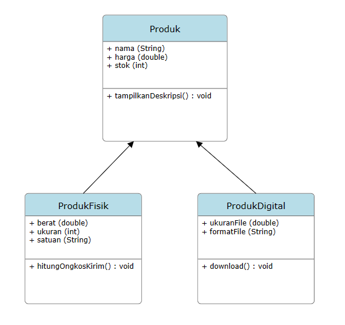
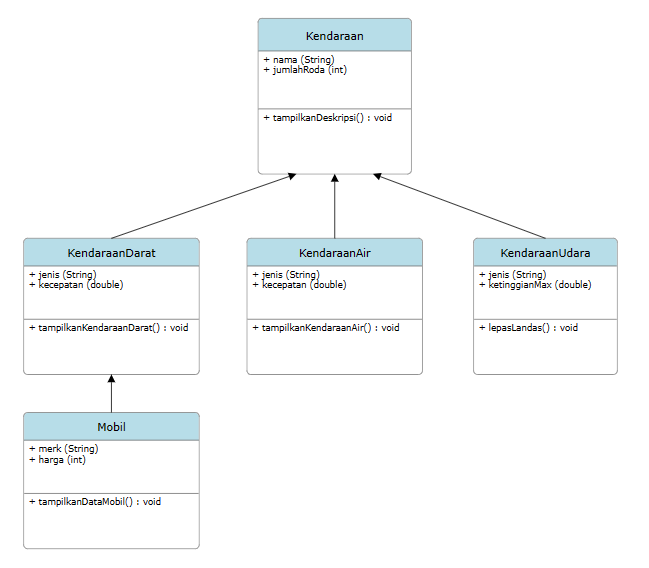
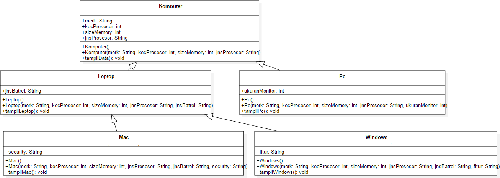
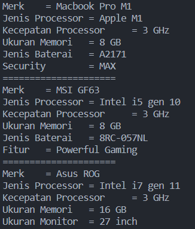

# Praktikum 7 - Inheritance 2

Nama : Muhammad Naufal Haidar Setyawan <br>
NIM : 2241720097 <br>
Kelas : 2C <br>
No. Absen : 18 <br>

## Latihan Tugas Teori

Carilah sebuah studi kasus dari hierarchical dan hybrid inheritance, kemudian gambarkan UML class diagramnya.

**Jawab :** <br>

- Hierarchical Inheritance : <br>

  

- Hybrid Inheritance : <br>

  

## Percobaan 1

Pertanyaan :

1. Sebutkan class mana yang termasuk super class dan sub class dari percobaan 1 diatas! <br>
   **Jawab :** <br>
   Super class : Karyawan <br>
   Sub class : Manager, Staff (keduanya merujuk ke class Karyawan)
2. Kata kunci apakah yang digunakan untuk menurunkan suatu class ke class yang lain? <br>
   **Jawab :** <br>
   _extends_
3. Perhatikan kode program pada class Manager, atribut apa saja yang dimiliki oleh class tersebut? Sebutkan atribut mana saja yang diwarisi dari class Karyawan! <br>
   **Jawab :** <br>
   Manager memiliki **atribut asli** yaitu `tunjangan` (int) dan **atribut warisan / turunan** dari class Karyawan yaitu `nama, alamat, jk` (String) dan `umur, gaji` (int)
4. Jelaskan kata kunci super pada potongan program dibawah ini yang terdapat pada class Manager!

   ```
   System.out.println("Total Gaji       ="+(super.gaji+tunjangan));
   ```

   **Jawab :** <br>
   Untuk memanggil atribut gaji pada super class (yaitu Karyawan) yang memiliki hak akses public.

5. Program pada percobaan 1 diatas termasuk dalam jenis inheritance apa? Jelaskan alasannya! <br>
   **Jawab :** <br>
   Hierarchical Inheritance

## Percobaan 2

Pertanyaan :

1. Berdasarkan class diatas manakah yang termasuk single inheritance dan mana yang termasuk multilevel inheritance? <br>
   **Jawab :** <br>
   Kelas Manager yang mewarisi Kelas Karyawan merupakan Single Inheritance. <br>
   Kelas StaffHarian dan StaffTetap yang mewarisi Kelas Staff, lalu juga Kelas Staff yang mewarisi Kelas Karyawan merupakan Multilevel Inheritance.
2. Perhatikan kode program class StaffTetap dan StaffHarian, atribut apa saja yang dimiliki oleh class tersebut? Sebutkan atribut mana saja yang diwarisi dari class Staff! <br>
   **Jawab :** <br>
   StaffTetap memiliki atribut asli `golongan` (String) dan `asuransi` (int) dan StaffHarian memiliki atribut asli `jmlJamKerja` (int). Keduanya mewarisi atribut turunan dari Kelas Staff yaitu `lembur, potongan` (int) dan atribut turunan dari Kelas Karyawan yaitu `nama, alamat, jk` (String) dan `umur, gaji` (int).
3. Apakah fungsi potongan program berikut pada class StaffHarian

   ```
   super(nama,alamat,jk,umur,gaji,lembur,potongan);
   ```

   **Jawab :** <br>
   Untuk memanggil konstruktor pada Super Class (yaitu Kelas Staff) yang berparameter seperti yang disebutkan.

4. Apakah fungsi potongan program berikut pada class StaffHarian

   ```
   super.tampilDataStaff();
   ```

   **Jawab :** <br>
   Untuk memanggil method pada Super Class (yaitu Kelas Staff) yang bernama `tampilDataStaff()`.

5. Perhatikan kode program dibawah ini yang terdapat pada class StaffTetap

   ```
   System.out.println("Gaji Bersih     ="+(gaji+lembur-potongan-asuransi));
   ```

   Terlihat dipotongan program diatas atribut gaji, lembur dan potongan dapat diakses langsung. Kenapa hal ini bisa terjadi dan bagaimana class StaffTetap memiliki atribut gaji, lembur, dan potongan padahal dalam class tersebut tidak dideklarasikan atribut gaji, lembur, dan potongan? <br>
   **Jawab :** <br>
   Karena atribut tersebut memiliki hak akses public yang mana dapat diakses dari kelas manapun. Atribut tersebut merupakan atribut turunan dari Super Class yaitu Kelas Staff.

## Tugas

Buatlah sebuah program dengan konsep pewarisan seperti pada class diagram berikut ini. Kemudian buatlah instansiasi objek untuk menampilkan data pada class Mac, Windows dan Pc!.


**Jawab :** Kode ada di folder `/Tugas` <br>
**Output :** <br>


