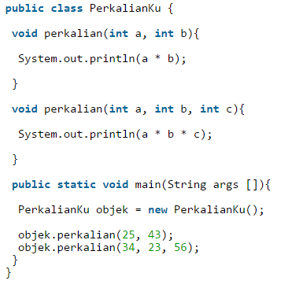
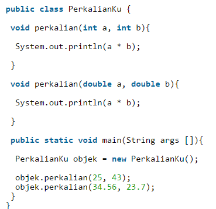
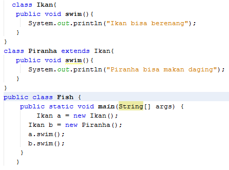
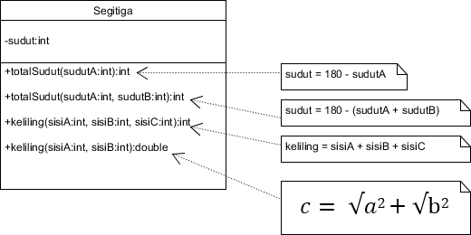
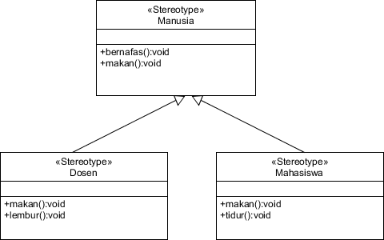

Nama : Muhammad Naufal Haidar Setyawan <br>
NIM : 2241720097 <br>
Kelas : 2C <br>
No. Absen : 18 <br>

## Latihan <br>

<br>

1. Dari source coding diatas terletak dimanakah overloading?<br>
   **Jawab:**<br>
   Pada method kedua yaitu
   ```
   void perkalian(int a, int b, int c) {
    System.out.println(a * b * c);
   }
   ```
   karena memiliki nama method yang sama namun parameter yang berbeda.
2. Jika terdapat overloading ada berapa jumlah parameter yang berbeda?<br>
   **Jawab:**<br>
   2, yaitu `perkalian(int a, int b)` dan `perkalian(int a, int b, int c)`

   <br>

3. Dari source coding diatas terletak dimanakah overloading?<br>
   **Jawab:**<br>
   Pada method kedua yaitu
   ```
   void perkalian(double a, double b) {
    System.out.println(a * b);
   }
   ```
   karena memiliki nama method yang sama namun parameter yang berbeda.
4. Jika terdapat overloading ada berapa tipe parameter yang berbeda?<br>
   **Jawab:**<br>
   2, yaitu `perkalian(int a, int b)` dan `perkalian(double a, double b)`

   <br><br>

5. Dari source coding diatas terletak dimanakah overriding?<br>
   **Jawab:**<br>
   Pada method `swim()` di class Piranha
6. Jabarkanlah apabila sourcoding diatas jika terdapat overriding?<br>
   **Jawab:**<br>
   Pada fungsi main, saat objek b dibuat dengan class Ikan dan konstruktor Piranha, maka saat memanggil method swim() pada objek b, yang terpanggil adalah method swim() yang ada pada class Piranha, karena method tersebut menimpa method yang ada pada superclass.

## Tugas

- Overloading
  <br>
  **Jawab:** <br>

  ```
  package Tugas.Overloading;

  public class Segitiga {
      private int sudut;

      public int totalSudut(int sudutA) {
          this.sudut = 180 - sudutA;
          return sudut;
      }

      public int totalSudut(int sudutA, int sudutB) {
          this.sudut = 180 - (sudutA + sudutB);
          return sudut;
      }

      public int keliling(int sisiA, int sisiB, int sisiC) {
          return sisiA + sisiB + sisiC;
      }

      public double keliling(int sisiA, int sisiB) {
          return sisiA + sisiB + (Math.sqrt(Math.pow(sisiA, 2) + Math.pow(sisiB, 2)));
      }

      public static void main(String[] args) {
          Segitiga s = new Segitiga();
          System.out.println(s.keliling(3, 4));
      }
  }

  ```

- Overriding
  <br>
  **Jawab:**<br>

  ```
  package Tugas.Overriding;

  public class Manusia {
      void bernafas() {
          System.out.println("Manusia bernafas.");
      }

      void makan() {
          System.out.println("Manusia makan.");
      }
  }

  class Dosen extends Manusia {
      void makan() {
          System.out.println("Dosen makan.");
      }

      void lembur() {
          System.out.println("Dosen lembur.");
      }
  }

  class Mahasiswa extends Manusia {
      void makan() {
          System.out.println("Mahasiswa makan.");
      }

      void tidur() {
          System.out.println("Mahasiswa tidur.");
      }
  }

  class Main {
      public static void main(String[] args) {
          Manusia a = new Dosen();
          a.makan();
          a.bernafas();
          Manusia b = new Mahasiswa();
          b.makan();
          b.bernafas();
      }
  }
  ```
