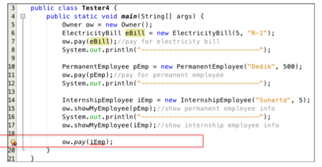

Nama : Muhammad Naufal Haidar Setyawan  
NIM : 2241720097  
Kelas : 2C  
No. Absen : 18  

## Pertanyaan

### Percobaan 1

1.  Class apa sajakah yang merupakan turunan dari class Employee?  
    **Jawab :** 
    `InternshipEmployee` dan `PermanentEmployee`
2.  Class apa sajakah yang implements ke interface Payable? 
    **Jawab :** 
    `PermanentEmployee` dan `ElectricityBill`
3.  Perhatikan class Tester1, baris ke-10 dan 11. Mengapa e, bisa diisi dengan objek pEmp (merupakan objek dari class PermanentEmployee) dan objek iEmp (merupakan objek dari class InternshipEmploye)? 
    **Jawab :** 
    Karena class `InternshipEmployee` dan `PermanentEmployee` merupakan subclass dari `Employee`, sehingga class Employee bisa menampung objek dari class turunannya (Konsep Pewarisan).
4.  Perhatikan class Tester1, baris ke-12 dan 13. Mengapa p, bisa diisi dengan objek pEmp (merupakan objek dari class PermanentEmployee) dan objek eBill (merupakan objek dari class ElectricityBill) ? 
    **Jawab :** 
    Karena class `PermanentEmployee` dan `ElectricityBill` mengimplementasi dari interface class `Payable`, sehingga class `Payable` memungkinkan untuk menampung objek dari class yang mengimplementasinya (Konsep Perwarisan).
5.  Coba tambahkan sintaks:  
     p = iEmp;
    e = eBill;  
     pada baris 14 dan 15 (baris terakhir dalam method main) ! Apa yang menyebabkan error? 
    **Jawab :** 
    Karena class `InternshipEmployee` tidak memiliki hubungan pewarisan dengan class `Payable` dan class `ElectricityBill` juga tidak memiliki hubungan pewarisan dengan class `Employee`.
6.  Ambil kesimpulan tentang konsep/bentuk dasar polimorfisme! 
    **Jawab :** 
    Konsep polimorfisme memperluas fleksibilitas dalam pengembangan kode, memungkinkan penggunaan yang lebih dinamis dan perluasan sistem dengan menambahkan kelas baru tanpa memodifikasi kode yang sudah ada, serta memfasilitasi penggunaan yang lebih efisien dari konsep pewarisan dan antarmuka dalam pemrograman berorientasi objek.

### Percobaan 2

1. Perhatikan class Tester2 di atas, mengapa pemanggilan e.getEmployeeInfo() pada baris 8 dan pEmp.getEmployeeInfo() pada baris 10 menghasilkan hasil sama? 
   **Jawab :** 
   Karena method `getEmployeeInfo()` dari class `Employee` di override ke class `PermanentEmployee`, dan juga karena objek yang diinisialisasi dalam e adalah instance dari `PermanentEmployee`. Karena itulah, hasil dari `e.getEmployeeInfo()` dan `pEmp.getEmployeeInfo()` sama karena keduanya menggunakan implementasi yang sama dari yaitu yang ada di kelas `PermanentEmployee`
2. Mengapa pemanggilan method e.getEmployeeInfo() disebut sebagai pemanggilan method virtual (virtual method invication), sedangkan pEmp.getEmployeeInfo() tidak? 
   **Jawab :** 
   Karena dalam konsep polimorfisme, metode yang dipanggil pada saat runtime ditentukan berdasarkan objek yang sebenarnya diinisialisasi dalam variabel, bukan berdasarkan tipe deklarasi variabel tersebut. Dalam konteks kode tersebut, meskipun e dideklarasikan dengan tipe data `Employee`, namun objek yang diinisialisasi dalam e adalah objek dari class `PermanentEmployee`.
3. Jadi apakah yang dimaksud dari virtual method invocation? Mengapa disebut virtual? 
   **Jawab :** 
   Virtual method invocation (VMI) mengacu pada pemanggilan metode yang dilakukan pada saat runtime, di mana metode yang akan dijalankan ditentukan oleh objek yang sebenarnya diinisialisasi, bukan oleh tipe variabel yang digunakan untuk memanggil metode tersebut.
   Metode disebut "virtual" karena pada saat kompilasi, compiler tidak secara pasti mengetahui metode mana yang akan dipanggil pada saat runtime karena variabel dapat merujuk pada objek dari kelas-kelas turunannya. Pemilihan metode yang tepat terjadi saat program dijalankan dan tergantung pada jenis objek yang sebenarnya diinisialisasi dalam variabel tersebut. Java dan bahasa lain yang mendukung polimorfisme menggunakan konsep ini, di mana pemanggilan metode dilakukan secara "virtual" karena ditentukan oleh objek yang sebenarnya dijalankan pada saat program berjalan, bukan pada saat kompilasi.

### Percobaan 3

1. Perhatikan array e pada baris ke-8, mengapa ia bisa diisi dengan objek-objek dengan tipe yang berbeda, yaitu objek pEmp (objek dari PermanentEmployee) dan objek iEmp (objek dari InternshipEmployee) ? 
   **Jawab :** 
   Karena kedua objek tersebut merupakan subclass dari class `Employee`
2. Perhatikan juga baris ke-9, mengapa array p juga biisi dengan objek-objek dengan tipe yang berbeda, yaitu objek pEmp (objek dari PermanentEmployee) dan objek eBill (objek dari ElectricityBilling) ? 
   **Jawab :** 
   Karena kedua objek tersebut mengimplementasi interface dari class `Payable`
3. Perhatikan baris ke-10, mengapa terjadi error? 
   **Jawab :** 
   Karena objek `eBill` tidak memiliki hubungan pewarisan dengan class `Employee`

### Percobaan 4

1. Perhatikan class Tester4 baris ke-7 dan baris ke-11 mengapa pemanggilan ow.pay(eBill) dan ow.pay(pEmp) bisa dilakukan, padahal jika diperhatikan method pay() yang ada di dalam class Owner memiliki argument/parameter bertipe Payable?  Jika diperhatikan lebih detil eBill merupakan objek dari ElectricityBill dan pEmp merupakan objek dari PermanentEmployee 
   **Jawab :** 
   Karena kedua kelas, yaitu `ElectricityBill` dan `PermanentEmployee`, mengimplementasikan antarmuka atau kelas yang sama, yaitu `Payable`. Dalam kasus ini, metode `pay()` di kelas Owner menerima parameter bertipe `Payable`, dan keduanya (`ElectricityBill` dan `PermanentEmployee`) mengimplementasikan interface ini.
2. Jadi apakah tujuan membuat argument bertipe Payable pada method pay() yang ada di dalam class Owner? 
   **Jawab :** 
   Dengan menggunakan argumen bertipe `Payable`, metode `pay()` dapat digunakan dengan objek apa pun yang mengimplementasikan `Payable`, tidak hanya dengan objek dari satu kelas tertentu (misalnya, ElectricityBill atau PermanentEmployee), tetapi juga dengan objek dari kelas lain yang mengimplementasikan Payable di masa depan tanpa perlu mengubah metode pay() di kelas `Owner`.
3. Coba pada baris terakhir method main() yang ada di dalam class Tester4 ditambahkan perintah ow.pay(iEmp);
   
   Mengapa terjadi error? 
   **Jawab :** 
   Karena objek `iEmp` tidak memiliki hubungan pewarisan (tidak mengimplementasi interface) dengan class `Payable`
4. Perhatikan class Owner, diperlukan untuk apakah sintaks p instanceof ElectricityBill pada baris ke-6 ? 
   **Jawab :** 
   `instanceof` digunakan untuk memeriksa apakah objek yang diterima sebagai argumen (dalam hal ini, p) adalah suatu instance dari kelas `ElectricityBill` atau bukan. Dengan kata lain, sintaks tersebut memeriksa apakah objek yang dilewatkan ke metode `pay()` adalah objek dari kelas `ElectricityBill` atau turunannya.
5. Perhatikan kembali class Owner baris ke-7, untuk apakah casting objek disana (ElectricityBill eb = (ElectricityBill) p) diperlukan ? Mengapa objek p yang bertipe Payable harus di-casting ke dalam objek eb yang bertipe ElectricityBill ? 
   **Jawab :** 
   Untuk mengubah referensi objek yang bertipe `Payable` menjadi referensi objek yang sebenarnya, yaitu objek yang bertipe `ElectricityBill`. Casting tersebut dilakukan agar dapat mengakses metode atau properti khusus yang hanya ada dalam kelas `ElectricityBill`, yang tidak tersedia dalam tipe data umum `Payable`.
