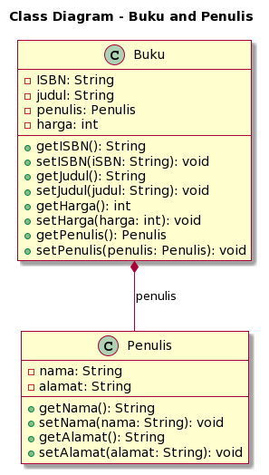

# UJIAN TENGAH SEMESTER

Nama : Muhammad Naufal Haidar Setyawan <br>
NIM : 2241720097 <br>
Kelas : 2C <br>
No. Absen : 18 <br>

## Soal 1 : Penulisan Class

Berdasarkan contoh class ClassA di bawah ini, jelaskan apakah penulisan source code pada contoh class tersebut sudah benar. Jika tidak, apa yang perlu diperbaiki?

```
public class ClassA {
    float f1 = 0.15f;

    float hitung() {
        float x = 2f * f1;
    }
}
```

**Jawab :** <br>
Terdapat kesalahan pada fungsi `hitung()` yang mana seharusnya ada kata kunci return diikuti dengan value yang memiliki tipe data yang sama. Sehingga seharusnya menjadi seperti ini :

```
float hitung() {
    return 2f * f1;
}
```

## Soal 2: Perhitungan Jumlah Elemen Array 2 Dimensi

Pada class SoalArray1, terdapat array 2 dimensi dengan ukuran 3x3. Tuliskan code Java untuk menghitung jumlah total elemen array tersebut dengan menggunakan perulangan.

```
public class SoalArray1 {
    public static void main(String[] args) {
        int[][] arrayInt = {{1, 1, 4}, {2, 1, 2}, {3, 2, 1}};
        // hitung jumlah elemen array 2 dimensi
        // gunakan perulangan
    }
}
```

**Jawab :** <br>

```
...
        int counter = 0;
        for (int i = 0; i < arrayInt.length; i++) {
            for (int j = 0; j < arrayInt.length; j++) {
                counter++;
            }
        }

        System.out.println("Jumlah Elemen : " + counter);
...
```

## Soal 3: Pewarisan Atribut dan Method

Pada source code yang diberikan, class ClassY merupakan turunan dari class Class. Sebutkan atribut dan method apa saja yang diwarisi oleh ClassY dari kelas induknya (class Class). Jelaskan juga apa output dari code yang ditulis pada class ClassY dan bagaimana nilai tersebut diperoleh.

```
public class Class {
    int a = 2;
    int x = 0;

    int hitung() {
        x = x + 5 * a;
        return x;
    }
}

public class ClassY extends Class {
    int b = 5;
    int y = 0;

    int hitungY() {
        y = hitung() * b;
        return y;
    }

    public static void main(String[] args) {
        ClassY cy = new ClassY();
        System.out.println(cy.hitungY());
    }
}
```

**Jawab :** <br>
ClassY mewarisi seluruh atribut dan method dari class Class, yaitu int a, int x, dan int hitung(). <br>
Output pada main adalah `50`, yaitu hasil perhitungan pada method hitungY(), yang mana method tersebut akan melakukan perkalian antara hasil dari method hitung() dengan b. Method hitung() akan menghasilkan nilai kembalian yaitu nilai `x + 5 * a` yang hasilnya adalah `10`.

## Soal 4: Class Mahasiswa dengan Constructor

Dalam class Mahasiswa, lengkapi code dengan:
a. Menambahkan constructor untuk mengisi atribut nim, nama, alamat, dan jenisKelamin
b. Membuat objek mahasiswa dan mengisi atribut nim, nama, alamat, dan jenisKelamin melalui
constructor.

**Jawab :** <br>

```
public class Mahasiswa {
    String nim, nama, alamat;
    char jenisKelamin;

    // a. Tambahkan constructor
    // Gunakan constructor untuk
    // mengisi atribut nim, nama, alamat, jenisKelamin

    Mahasiswa(String nim, String nama, String alamat, char jenisKelamin) {
        this.nim = nim;
        this.nama = nama;
        this.alamat = alamat;
        this.jenisKelamin = jenisKelamin;
    }

    public static void main(String[] args) {
        // b. Buat objek mahasiswa
        // Isi atribut nim, nama, alamat, jenisKelamin
        // lewat constructor

        Mahasiswa mhs1 = new Mahasiswa("2241720097", "Muhammad Naufal Haidar Setyawan", "Pasuruan", 'L');
        System.out.println("Nama\t: " + mhs1.nama);
        System.out.println("NIM\t: " + mhs1.nim);
        System.out.println("Alamat\t: " + mhs1.alamat);
        System.out.println("Jenis Kelamin\t: " + mhs1.jenisKelamin);
    }
}
```

## Soal 5: OOP Buku -> Penulis

Perhatikan class diagaram berikut dan Buatlah Source code dalam Bahasa java berdasarkan class diagram tersebut <br>

 <br>

Class `Penulis`

```
public class Penulis {
    private String nama, alamat;

    String getNama() {
        return nama;
    }

    void setNama(String nama) {
        this.nama = nama;
    }

    String getAlamat() {
        return alamat;
    }

    void setAlamat(String alamat) {
        this.alamat = alamat;
    }
}

```

Class `Buku`

```
public class Buku {
    private String ISBN, judul;
    private Penulis penulis;
    private int harga;

    String getISBN() {
        return ISBN;
    }

    void setISBN(String iSBN) {
        this.ISBN = iSBN;
    }

    String getJudul() {
        return judul;
    }

    void setJudul(String judul) {
        this.judul = judul;
    }

    int getHarga() {
        return harga;
    }

    void setHarga(int harga) {
        this.harga = harga;
    }

    Penulis getPenulis() {
        return penulis;
    }

    void setPenulis(Penulis penulis) {
        this.penulis = penulis;
    }
}

```
